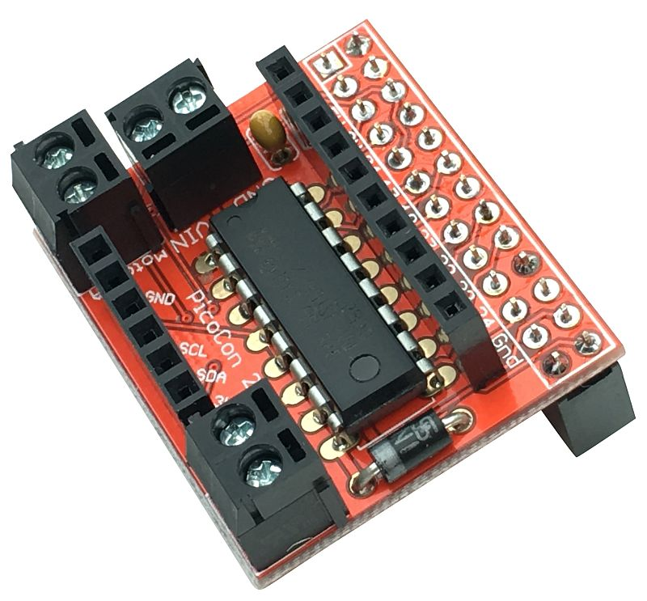

- With your motor controller board and motors setup, you can use a little bit of Python to control the motors.

- Open IDLE, by clicking on `Menu` > `Programming` > `Python 3 (IDLE)`.

- Create a new file, by clicking on `File` > `New File`. Save you new file as `motor_test.py`

### Controlling individual motors.
- If you only have one motor attached, or want to control them independently of each other, then you can use the `Motor` class in `gpiozero`.

- At the top of your file, type the following to import the class.

	```python
	from gpiozero import Motor
	```

- The standard motor controller board used in many Raspberry Pi resources is the [PicoCon Board](http://4tronix.co.uk/store/index.php?rt=product/product&path=66_71&product_id=585){:target="_blank"}.

	
	
- This uses GPIO pins `7` and `8` for one motor, and pins `9` and `10` for the other motor. You need to create a `Motor` object using one of these sets of pins, depending on which one you want to control.

	```python
	motor_1 = Motor(7, 8)
	```
- Now you can use the following commands, to drive your motors.

	```python
	motor_1.forward()
	motor_1.backward()
	motor_1.stop()
	```

- You could use the sleep function, to let the motors run for any length of time.

	```python
	from time import sleep

	motor_1.forward()
	sleep(5)
	motor_1.stop()
	```
- Both the `forward` and `backward` methods can also take a `float` to control the speed.

	```python
	motor_1.forward(0.5)
	```
	
### Controlling both motors.
- If you want to control both motors simultaneously, then you can use the `Robot` class. For example:

```python
from gpiozero import Robot
from time import sleep
robot = Robot(left = (7, 8), right = (9, 10))

robot.forward()
sleep(3)
robot.stop()
robot.right(0.5)
sleep(2)
robot.backward()
```
